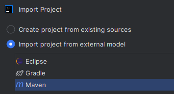
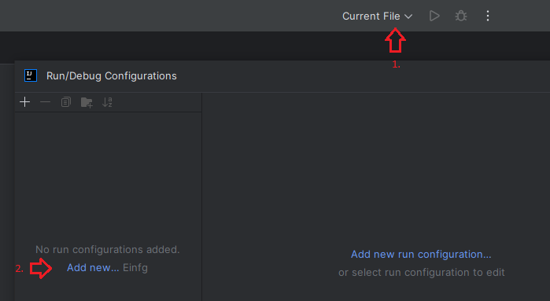
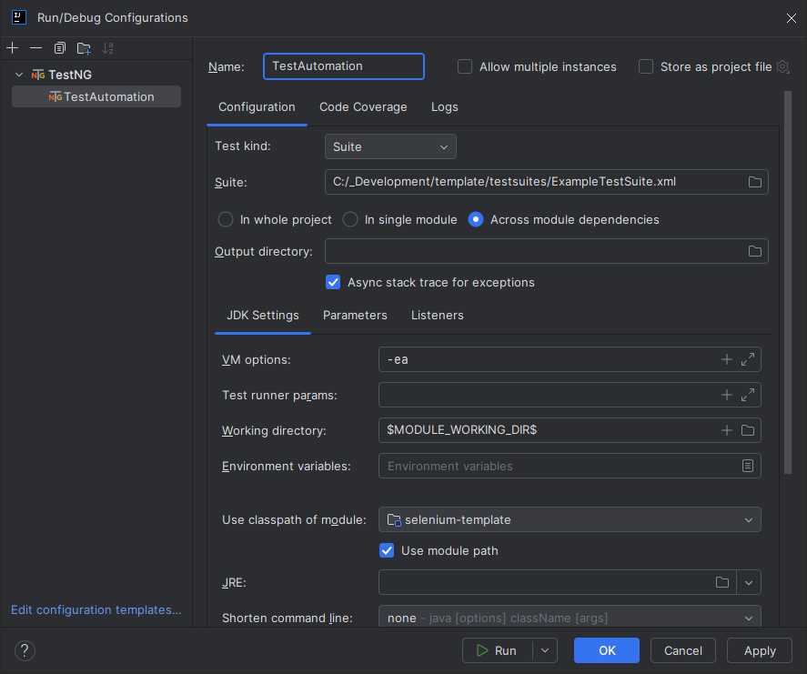
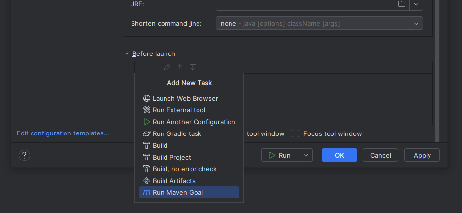
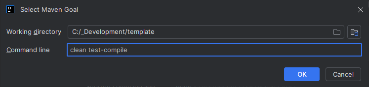
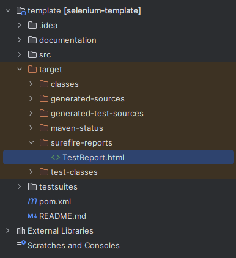

# Selenium Template
This is a Selenium template project.

## Built With
* [Java](https://www.oracle.com/java/technologies/downloads/#java21) - Programming Language (Oracle JDK 21)
* [Maven](https://maven.apache.org/download.cgi) - Build Management
* [Selenium](https://selenium.dev/) - Framework for automated control of a web browser
* [TestNG](https://testng.org/) - Unit Test Framework
* [ExtentReports](http://extentreports.com/) - Reporting Framework

The tested versions of the individual components can be found in [pom.xml](pom.xml).

## Getting Started

### Requirements
Java and Maven must be set up on the respective execution environment.

To run the test locally, browsers Mozilla Firefox and/or Google Chrome must be installed.

### Installation
Copy all template files into destination folder.

To download all necessary dependencies, run the following Maven command in the base folder:

```
mvn clean test-compile
```

### Test Execution from command line

#### Without additional params
```
mvn clean test -DsuiteXmlFile="testsuites/ExampleTestSuite.xml"
```

#### With additional params
```
mvn clean test -DsuiteXmlFile="testsuites/ExampleTestSuite.xml" -DdriverType="FIREFOX" -DtestEnvironment="http://localhost:3000/"
```

#### Parameter explanation
* `driverType` - specifies which WebDriver should be used (and therefore which browser)
* `testEnvironment` - URL to the Application Under Test
* `suiteXmlFile` - specifies which TestSuite should be executed

The **driverType** parameter can have the following values:

* CHROME - local WebDriver for Google Chrome
* FIREFOX - local WebDriver for Mozilla Firefox
* CHROME-REMOTE - RemoteWebDriver for remote execution via Selenium Hub -> Chrome Node
* FIREFOX-REMOTE - RemoteWebDriver for remote execution via Selenium Hub -> Firefox Node

If the parameter has no value, a local Chrome driver is used by default.

**Note:** The WebDriver instances are created with help of
[WebDriverManager](https://github.com/bonigarcia/webdrivermanager)

-----

### Test Execution in IDE

NOTE: The following steps are related to IntelliJ.
Please adapt it to other IDEs.

#### 1. Import project

Create new project (New > Project from existing sources) and import project as Maven project.



#### 2. Define TestNG configuration

To create a new run configuration choose "Edit configuration" in top menu (Hint: Open dropdown "Current file").

In dialog "Run/Debug Configurations" select "Add new..." and choose option "TestNG". If this option is missing ensure IntelliJ plugin "TestNG" is activated.



First create a new TestNG configuration and specify a unique name for it.

Then set Test kind to "Suite", choose test suite and verify settings for classpath.   


Also add a Maven command before starting.


This command ensures that all test resources are recompiled.


#### 3. Prepare property file
For local execution via an IDE, the properties from the [execution.properties](src/test/resources/execution.properties) are used.
These properties only apply if they have not been overwritten by Maven properties.

See [GettingStartedGuide.pdf](documentation/GettingStartedGuide.pdf) for a detailed description of this file.


#### 4. Run test suite
The configuration can then be executed directly in the IDE.


#### 5. Show report
The report can then be found in the target folder under surefire-reports.


As this is an HTML report, the report can be opened with the browser.

-----

## Writing test cases

All information how to work with this template can be found here: [GettingStartedGuide.pdf](documentation/GettingStartedGuide.pdf).

This includes:
* Folder structure
* Step-by-step to create new tests

-----

## Contact
accompio PrimeTec Gmbh - [tek-support@pro.accompio.com](mailto:tek-support@pro.accompio.com)